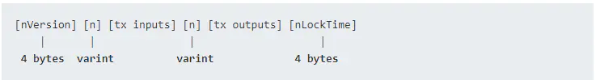

# 交易（Transaction）
比特币交易是比特币系统中最重要的部分。下面以一个测试网络交易为例子进行说明。

## 序列化交易信息
当交易通过网络传输或在应用程序之间交换时，它们是序列化的。序列化是将数据结构的内部表示转换为可以一次发送一个字节的格式（也称为字节流）的过程。

下面是一个测试网中序列化后的交易信息
```
0100000001ee3a50b918ca4c232d56f991ef66df2c7683c61743f29b04616dd51ec6b952f7000000006b483045022100d55e97e70a3e562feda4c21e4d50d9148a3c19dc068ed695781b8f742709e938022008d27447261cd0865a4ed22902ed572d63c66a767c361a309ce59b5f3a8b6a8a012103cc6ebd10797b6ef801eb98c901ecfc94b80f9bc0aff920457aadf0f956db82faffffffff02002d3101000000001976a914571870875adf08ce52aab0639b4b1b45f37333a288acea959800000000001976a91483ad7e5a09b46fd0e23202083a542068ccb4fb4488ac00000000
```

对以上序列化交易信息反序列化后可以得到具有可读性的交易内容，[这里](./data/tx_decode.json)可查看完整交易解码结果。

## 交易结构
目前存在两种交易结构。比特币白皮书中定义的交易结构和新的隔离见证交易结构。

下表是白皮书中定义的交易结构：



下面对每个字段按照交易结构进行拆解说明：

- Version, 4 bytes, Little-endian

  对应的序列化值为 **01000000**，由于是小端模式，即对应版本 `version` 值为 `1`

- Input Counter, 1–9 bytes, VarInt

  `VarInt` 是比特币中的可变字节类型，用动态字节数量表示数据大小，如下规律：
  | 数据值               |    例子             |              备注           |
  |---------------------|--------------------|-----------------------------|
  |<= 0xfc              |0x12                | 1 个字节                     |
  |<= 0xffff            |0xfd1234            | 前缀是fd，小端表示接下来的2个字节|
  |<= 0xffffffff        |0xfe12345678	       | 前缀是fe，小端表示接下来的4个字节|
  |<= 0xffffffffffffffff|0xff1234567890abcdef| 前缀是ff，小端表示接下来的8个字节|

  交易信息中第5个字节为 `01`，没有 fd、fe、ff 前缀，所以我们知道它是用1个字节表示输入交易数量。`01` 的十进制值为 `1`，表示后续的输入交易数量是1。

- Inputs

  |   字段 |     大小  |	    备注      |
  |-------|-----------|---------------|
  | TXID	| 32 bytes	| Little-endian |
  | VOUT  |	4 bytes	  | Little-endian |
  | ScriptSig Size  |	1–9 bytes	| VarInt |
  | ScriptSig     	| Variable	| |
  | Sequence	      | 4 bytes   |	Little-endian |

  [vin 0]
  - `TXID`，序列化值为 **ee3a50b918ca4c232d56f991ef66df2c7683c61743f29b04616dd51ec6b952f7**，由于是小端模式，即对应 `txid` 为 `f752b9c61ed56d61049bf24317c683762cdf66ef91f9562d234cca18b9503aee`
  - `VOUT`，序列化值为 **00000000**，即对应 `vout` 为 `0`
  - `ScriptSig Size`，序列化值为 **6b**，即对应十进制为 `107`，表示后续的 `ScriptSig` 占107个字节
  - `ScriptSig`，序列化值为 **483045022100d55e97e70a3e562feda4c21e4d50d9148a3c19dc068ed695781b8f742709e938022008d27447261cd0865a4ed22902ed572d63c66a767c361a309ce59b5f3a8b6a8a012103cc6ebd10797b6ef801eb98c901ecfc94b80f9bc0aff920457aadf0f956db82fa**
  - `Sequence`，序列化值为 **ffffffff**，即对应 `sequence` 为 `4294967295`
  
- Output Counter, 1–9 bytes, VarInt
  在 `Inputs` 之后紧接着的是输出交易数量 `02`，没有 fd、fe、ff 前缀，所以我们知道它是用1个字节表示输出交易数量。`02` 的十进制值为 `2`，表示后续的输出交易数量是2。

- Outputs

  |       字段         |     大小  |	    备注      |
  |-------------------|-----------|---------------|
  | Value	            |  8 bytes	| Little-endian |
  | ScriptPubKey Size	|  1–9 bytes| VarInt |
  | ScriptPubKey	    |  Variable |        |

  [vout 0]
  - `Value`，序列化值为 **002d310100000000**，由于是小端模式，即对应值为 `00000000001312d00`，转换为十进制值为 `20000000`
  - `ScriptPubKey Size`，序列化值为 **19**，即对应十进制为 `25`，表示后续的 `ScriptPubKey` 占25个字节
  - `ScriptPubKey`，序列化值为 **76a914571870875adf08ce52aab0639b4b1b45f37333a288ac**，表示公钥脚本为 `76a914571870875adf08ce52aab0639b4b1b45f37333a288ac`

  [vout 1]
  - `Value`，序列化值为 **ea95980000000000**，由于是小端模式，即对应值为 `000000000009895ea`，转换为十进制值为 `9999850`
  - `ScriptPubKey Size`，序列化值为 **19**，即对应十进制为 `25`，表示后续的 `ScriptPubKey` 占25个字节
  - `ScriptPubKey`，序列化值为 **76a91483ad7e5a09b46fd0e23202083a542068ccb4fb4488ac**，表示公钥脚本为 `76a91483ad7e5a09b46fd0e23202083a542068ccb4fb4488ac`

- Locktime, 4 bytes, Little-endian
  末尾4字节 **00000000** 表示锁定时间为 0。

通过对交易结构拆解分析，你会对交易信息的组成有个基本的了解，下文会对交易的输入输出作更进一步的说明。

## 交易输入
交易输入是一个名为 vin 的数组：

```json
"vin": [
  {
    "txid": "f752b9c61ed56d61049bf24317c683762cdf66ef91f9562d234cca18b9503aee",
    "vout": 0,
    "scriptSig": {
      "asm": "3045022100d55e97e70a3e562feda4c21e4d50d9148a3c19dc068ed695781b8f742709e938022008d27447261cd0865a4ed22902ed572d63c66a767c361a309ce59b5f3a8b6a8a[ALL] 03cc6ebd10797b6ef801eb98c901ecfc94b80f9bc0aff920457aadf0f956db82fa",
      "hex": "483045022100d55e97e70a3e562feda4c21e4d50d9148a3c19dc068ed695781b8f742709e938022008d27447261cd0865a4ed22902ed572d63c66a767c361a309ce59b5f3a8b6a8a012103cc6ebd10797b6ef801eb98c901ecfc94b80f9bc0aff920457aadf0f956db82fa"
    },
    "sequence": 4294967295
  }
]
```

如上所示，交易输入包含四个元素：
- 一个交易ID，引用包含正在使用的UTXO的交易
- 一个输出索引（vout），用于标识来自该交易的哪个UTXO被引用（第一个为零）
- 一个 scriptSig（解锁脚本），满足放置在UTXO上的条件，解锁它用于支出
- 一个序列号

输入指向的交易ID是：
```
f752b9c61ed56d61049bf24317c683762cdf66ef91f9562d234cca18b9503aee
```
输出索引是0（即由该交易创建的第一个UTXO）。通过检索[交易信息](https://www.blockchain.com/btc-testnet/tx/f752b9c61ed56d61049bf24317c683762cdf66ef91f9562d234cca18b9503aeeß)，可以得到输入中引用的UTXO，如下：

```
"vout": [
   {
     "value": 0.30000000,
     "scriptPubKey": "OP_DUP OP_HASH160 83ad7e5a09b46fd0e23202083a542068ccb4fb44 OP_EQUALVERIFY OP_CHECKSIG"
   }
 ]
```

可以看到这个UTXO的值为 0.3 BTC，同时包含一个“OP_DUP OP_HASH160...”的锁定脚本（scriptPubKey）。

交易输入中的解锁脚本（scriptSig）是：
```
483045022100d55e97e70a3e562feda4c21e4d50d9148a3c19dc068ed695781b8f742709e938022008d27447261cd0865a4ed22902ed572d63c66a767c361a309ce59b5f3a8b6a8a012103cc6ebd10797b6ef801eb98c901ecfc94b80f9bc0aff920457aadf0f956db82fa
```
大多数情况下，解锁脚本是一个证明比特币所有权的数字签名和公钥，但是并不是所有的解锁脚本都包含签名。

序列号为 4294967295，对应十六进制 0xFFFFFFFF。

## 交易输出
交易输出是一个名为 vout 的数组：

```json
"vout": [
  {
    "value": 0.2,
    "n": 0,
    "scriptPubKey": {
      "asm": "OP_DUP OP_HASH160 571870875adf08ce52aab0639b4b1b45f37333a2 OP_EQUALVERIFY OP_CHECKSIG",
      "hex": "76a914571870875adf08ce52aab0639b4b1b45f37333a288ac",
      "reqSigs": 1,
      "type": "pubkeyhash",
      "addresses": [
        "moTUMqKxSXrGeF8ktYcawLLVr6Mg46TQdQ"
      ]
    }
  },
  {
    "value": 0.0999985,
    "n": 1,
    "scriptPubKey": {
      "asm": "OP_DUP OP_HASH160 83ad7e5a09b46fd0e23202083a542068ccb4fb44 OP_EQUALVERIFY OP_CHECKSIG",
      "hex": "76a91483ad7e5a09b46fd0e23202083a542068ccb4fb4488ac",
      "reqSigs": 1,
      "type": "pubkeyhash",
      "addresses": [
        "msXCejAWLAPZym8JK2516x7gbu3giKWUP3"
      ]
    }
  }
]
```

如上所示，交易输出包含两部分：
- 比特币数量，面值为“聪”（satoshis），是最小的比特币单位；
- 确定花费输出所需条件的加密难题（cryptographic puzzle），这个加密难题也被称为锁定脚本(locking script), 见证脚本(witness script), 或脚本公钥 (scriptPubKey)。

## 比特币交易类型
### P2PKH（Pay-to-Public-Key-Hash）
示例：
```
<Signature> <Public Key> OP_DUP OP_HASH160 <Public Key Hash> OP_EQUALVERIFY OP_CHECKSIG
```

### P2MS（Pay-to-Multiple-Signatures）多重签名
示例：
```
0 <Signature 1> <Signature 2> ... <Signature M> M <Public Key 1> <Public Key 2> ... <Public Key N> N CHECKMULTISIG
```

标准多重签名脚本限制在最多15个列出的公钥。

### P2PK（Pay-to-Public-Key）
示例：
```
<Signature> <Public Key> OP_CHECKSIG
```

### P2SH（Pay-to-Script-Hash）
示例：
```
// Redeem Script（以多重签名脚本为例子）
M <Public Key 1> <Public Key 2> ... <Public Key N> N CHECKMULTISIG

// Locking Script
HASH160 <20-Byte Hash of Redeem Script> EQUAL

// Unlocking Script
0 <Signature 1> <Signature 2> ... <Signature M> <Redeem Script>
```

在P2SH交易中，锁定脚本被哈希值取代，原来的锁定脚本被称为兑换脚本Redeem Script，在以后花费输出时才作为解锁脚本的一部分出现。这会把费用和复杂性的负担从交易发送者转移给接收者（承担支出）。

### P2WPKH（Pay-to-Witness-Public-Key-Hash）
示例：
```
<Witness Version> <Public Key Hash>
0 ab68025513c3dbd2f7b92a94e0581f5d50f654e7
```

P2WPKH中的公钥哈希值是20字节。

### P2WSH(Pay-to-Witness-Script-Hash)
示例：
```
<Witness Version> <Witness Script Hash>
0 9592d601848d04b172905e0ddb0adde59f1590f1e553ffc81ddc4b0ed927dd73
```

P2WSH中的脚本哈希值是32字节，通过采用SHA256对脚本运算得到。

### P2SH(P2WPKH)  
示例：
```
// Redeem Script
<Witness Version> <Public Key Hash>

// Locking Script
HASH160 <20-Byte Hash of Redeem Script> EQUAL

// Unlocking Script
<Redeem Script>
```

### P2SH(P2WSH)

## 参考文档及工具
- [精通比特币-第六章 交易](https://github.com/tianmingyun/MasterBitcoin2CN/blob/master/ch06.md)
- [比特币区块分析文档](https://www.jianshu.com/p/5b0f42c62d97)
- [Bitcoin 区块和交易数据结构](https://segmentfault.com/a/1190000017055507#VarInt)
- [比特币交易解码工具](https://btc.com/tools/tx/decode)
